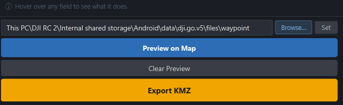

<div align="center">
  
</div>

# FlyPath

**FlyPath** is an open-source QGIS plugin for planning autonomous drone mapping missions and exporting them as native DJI WPML KMZ files — no conversion tools or third-party apps required.

Define your survey area directly on the map, configure flight parameters, preview the path, and export a ready-to-fly mission file loadable in the DJI Fly app.

Developed and maintained by [Dronnix](https://www.dronnix.com) — a drone mapping and geospatial AI company.

---

## Screenshots


---

## Key Features

- Draw the survey area directly on the QGIS map canvas using a native polygon drawing tool
- Import a survey area from any polygon layer or active QGIS selection
- Configurable flight altitude, speed, front overlap, side overlap, and flight direction
- Auto-optimised flight direction based on survey area geometry
- Live GSD (Ground Sampling Distance) and photo interval preview — synced to drone model and altitude
- Flight statistics: area, path distance, waypoint count, photo count, estimated batteries, and flight time
- Exports native DJI WPML KMZ — compatible with DJI Fly on DJI RC2
- **Direct RC export**: set the RC waypoint folder path once — FlyPath automatically finds and replaces the latest mission on the controller via USB
- Contextual info bar — hover over any parameter to see what it does
- Dark-themed dock panel — designed to complement the QGIS interface

---

## Requirements

| Requirement | Details |
|---|---|
| Operating System | Windows 10 / 11 |
| QGIS | 3.16 or later |
| Python | 3.9+ (bundled with QGIS) |
| Drone | DJI Mini 3 Pro or DJI Mini 4 Pro |
| Controller | DJI RC2 (for direct USB export) |

---

## Installation

### Option A — Install from ZIP *(recommended for now)*

1. Download the latest `FlyPath.zip` from the [Releases](https://github.com/dronnix-io/FlyPath/releases) page
2. In QGIS go to **Plugins → Manage and Install Plugins → Install from ZIP**
3. Select the downloaded ZIP and click **Install Plugin**

### Option B — Build from source

```shell
git clone https://github.com/dronnix-io/FlyPath.git
```

Copy the `FlyPath` folder into your QGIS plugins directory:

```
Windows: C:\Users\<you>\AppData\Roaming\QGIS\QGIS3\profiles\default\python\plugins\
```

Then enable it in QGIS via **Plugins → Manage and Install Plugins → Installed → FlyPath**.

### Launch the plugin

After installation, open FlyPath via:

**Plugins → FlyPath → FlyPath**

Or click the **FlyPath icon** in the QGIS toolbar. The plugin opens as a dock panel on the right side of the QGIS window.

---

## Workflow

### Step 1 — Define the survey area

Three ways to define your survey polygon:

- **Draw on Map** — click the button to activate the drawing tool, left-click to place vertices, right-click to finish. Backspace removes the last vertex, Escape cancels.
- **Layer / Feature** — select any polygon layer and feature already loaded in QGIS.
- **Use QGIS Selection** — select a polygon feature on the map canvas using QGIS's native selection tools, then click **Use QGIS Selection**.

Only one polygon can be active at a time. Switching methods automatically removes the previous survey area.

### Step 2 — Configure flight parameters

| Parameter | Description |
|---|---|
| Drone Model | Sets camera specs used for GSD and interval calculations |
| Mission Name | Embedded in the KMZ and used as the default export filename |
| Altitude | Flight altitude in metres (AGL or MSL) |
| Speed | Waypoint flight speed in m/s |
| Front Overlap | Along-track photo overlap percentage |
| Side Overlap | Cross-track strip spacing overlap percentage |
| Flight Direction | Angle of flight lines — or click **Auto** to optimise for the survey shape |
| Finish Action | What the drone does after the last waypoint |
| Altitude Mode | AGL (relative to takeoff point) or MSL (absolute WGS84) |

GSD and photo interval update live as you adjust altitude and overlap.

### Step 3 — Preview on Map

Click **Preview on Map** to generate the flight grid and display it on the canvas:

- **Blue polygon** — survey area boundary
- **Orange lines** — flight path connecting all waypoints
- **Orange circles** — mid-waypoints
- **Orange filled circle** — start waypoint
- **Blue filled circle** — end waypoint

Flight statistics (area, distance, photos, batteries, flight time) update below the parameters.



### Step 4 — Export KMZ

FlyPath supports two export workflows:

---

#### Workflow A — Direct RC Export (automatic)

This workflow replaces a mission directly on the DJI RC2 via USB — no manual copying or renaming required.

**Prerequisites:**
- Create at least one dummy waypoint mission in DJI Fly on the RC (even a 3-point mission works). This creates the UUID folder that FlyPath will replace.
- Connect the RC2 to your PC via USB.

**Setup (one time only):**

1. Click **Browse…** next to the RC path field — File Explorer opens at *This PC*
2. Navigate to: `DJI RC 2 › Internal shared storage › Android › data › dji.go.v5 › files › waypoint`
3. Click the address bar to reveal the full path, copy it (Ctrl+C)
4. Paste it into the RC path field in FlyPath and click **Set**

**Exporting:**

1. Click **Export KMZ**
2. FlyPath finds the most recent mission UUID on the RC, writes the new KMZ, and copies it directly into the UUID folder
3. A success message confirms which mission was replaced
4. Disconnect the RC, close and reopen DJI Fly — the updated mission will appear in the waypoints list

---

#### Workflow B — Manual Export

Use this workflow when the RC is not connected, or when you prefer to manage files manually.

1. Click **Export KMZ** — a standard save dialog opens
2. Choose a destination and filename on your PC
3. Connect your DJI RC2 via USB
4. In File Explorer, navigate to the RC's waypoint folder:
   `This PC › DJI RC 2 › Internal shared storage › Android › data › dji.go.v5 › files › waypoint`
5. Open the UUID folder of an existing mission (created by DJI Fly)
6. Copy the exported KMZ into that folder and rename it to `<UUID>.kmz` — matching the folder name exactly
7. Disconnect the RC, close and reopen DJI Fly — the mission will appear updated

---

## Supported Drones

| Drone | Waypoint Support | droneEnumValue | Verification |
|---|---|---|---|
| DJI Mini 3 Pro | Yes | 97 | Community-verified |
| DJI Mini 4 Pro | Yes | 68 | Verified from native RC2 mission dump |

> **Note:** DJI Mini 3 (standard) does **not** support waypoint missions and is not supported by FlyPath.

---

## Project Structure

```
FlyPath/
├── flypath.py            # QGIS plugin entry point
├── flypath_dialog.py     # Main UI panel and export logic
├── map_tools.py          # Interactive polygon drawing tool
├── grid_planner.py       # Flight grid and waypoint generation
├── wpml_writer.py        # DJI WPML KMZ file writer
├── metadata.txt          # QGIS plugin metadata
├── icon.png              # Plugin icon
├── icon.svg              # Plugin icon source
└── docs/
    └── images/           # README screenshots
```

---

## Known Limitations

- Windows only — direct RC export uses PowerShell Shell.Application for MTP device access
- Direct RC export requires a DJI RC2 connected via USB with at least one existing mission
- DJI Mini 3 Pro droneEnumValue (`97`) is community-verified — not confirmed from a native mission file
- 2D grid missions only — no terrain following, 3D facade, or orbit missions
- No automatic multi-battery mission splitting

---

## Contributing

Contributions are welcome. To get started:

1. Fork the repository
2. Create a feature branch: `git checkout -b feature/your-feature`
3. Commit your changes
4. Open a pull request against `main`

For bug reports and feature requests, please use the [issue tracker](https://github.com/dronnix-io/FlyPath/issues).

---

## License

This project is licensed under the **GNU General Public License v3.0** — see the [LICENSE](LICENSE) file for details.

---

## About Dronnix

[Dronnix](https://www.dronnix.com) is a drone mapping and geospatial AI company specialising in data collection and analysis for solar panel inspection, agriculture, urban growth monitoring, construction progress tracking, and large-scale mapping missions.

FlyPath is part of Dronnix's open tooling layer — free and open-source to support the drone mapping community.

**Contact:** [salar@dronnix.com](mailto:salar@dronnix.com)
