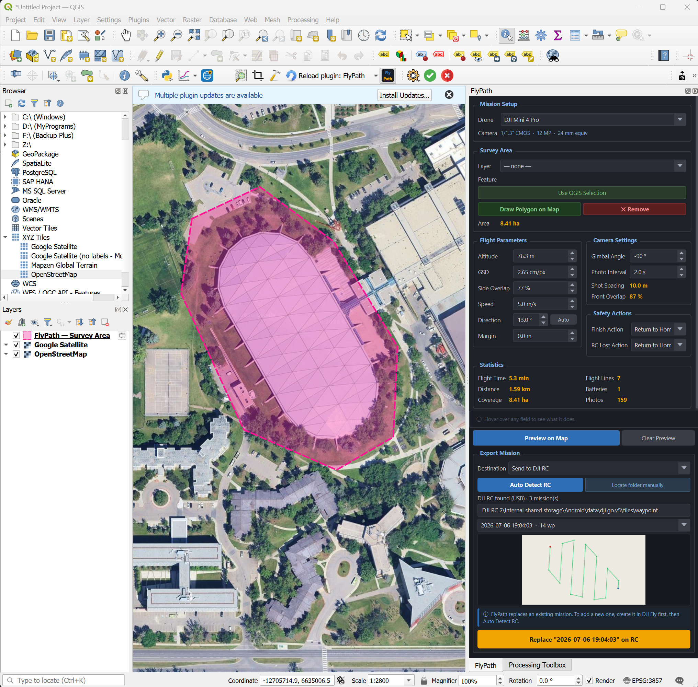
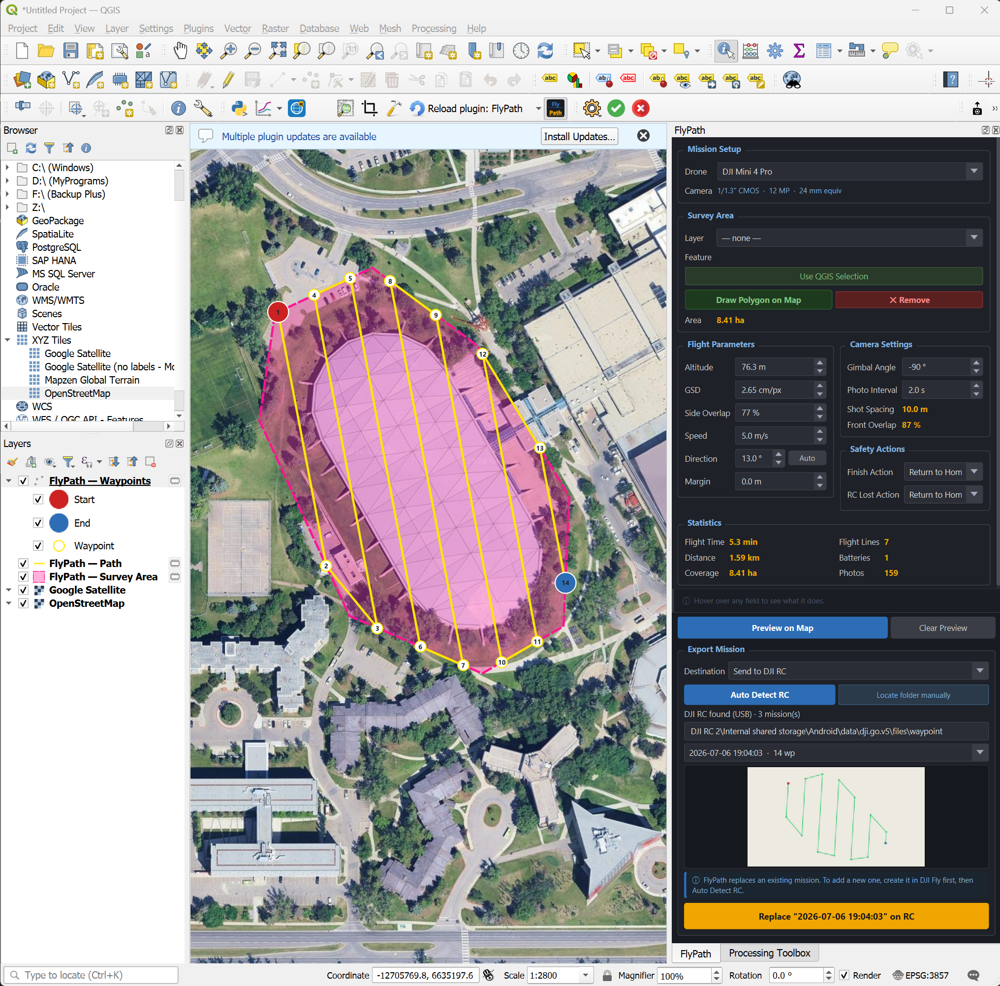
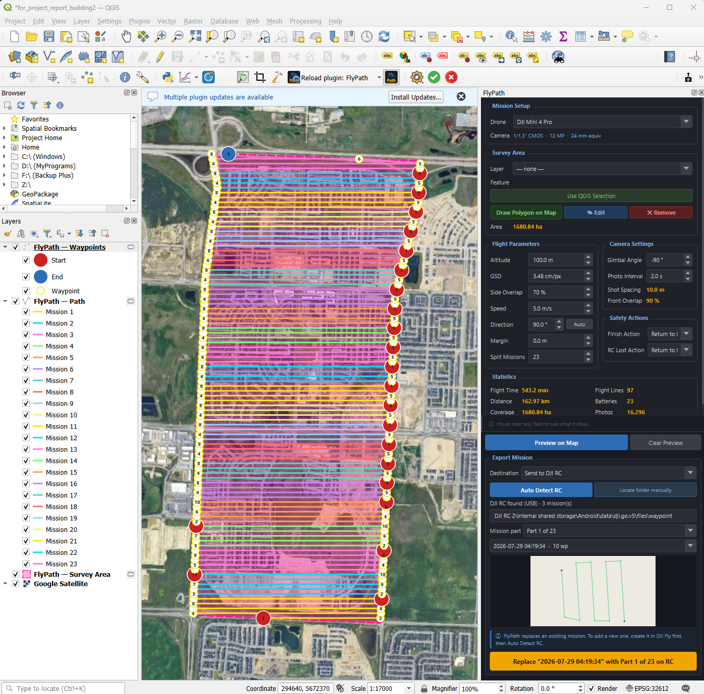
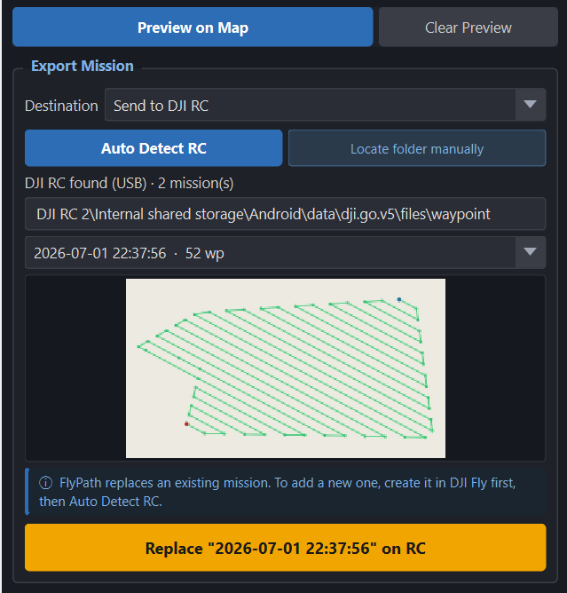
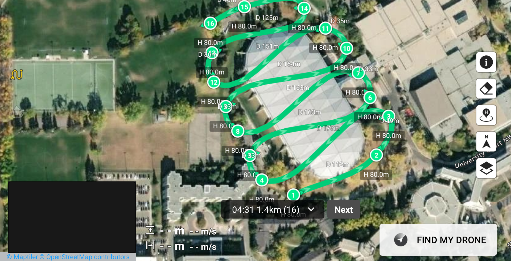

<div align="center">
  
</div>

# FlyPath

**FlyPath** is an open-source QGIS plugin for planning autonomous drone mapping missions and exporting them as native DJI WPML KMZ files, with no conversion tools or third-party apps required.

Define your survey area directly on the map, configure flight parameters, preview the path, and export a ready-to-fly mission file loadable in the DJI Fly app.

Developed and maintained by [Dronnix](https://www.dronnix.com), a drone mapping and geospatial AI company.

---

## Screenshots

FlyPath panel and flight-path preview:





The latest version adds multi-battery mission splitting. A large survey is divided into separate missions (one per battery), each drawn in its own color on the map and listed in the Layers panel, with a Mission part picker for sending each part to the RC:



---

## Video Tutorial

A walkthrough of installing and using FlyPath in QGIS: defining a survey area, setting flight parameters, previewing the path, and exporting a mission.

[](https://www.youtube.com/watch?v=uhaE7L8n0Fc)

> This video was recorded on an earlier release, so some of the interface has changed and newer features (such as multi-battery mission splitting) are not shown, but the core workflow is the same.

---

## Key Features

- Draw the survey area directly on the QGIS map canvas using a native polygon drawing tool
- Import a survey area from any polygon layer or active QGIS selection
- Two capture modes: **Semi-automatic** (you set the drone's auto interval capture before takeoff) and **Full-automatic** (experimental: a waypoint per photo with automatic shooting, stop-and-shoot, so no manual interval is needed)
- Configurable flight altitude, speed, side overlap, front overlap, and flight direction
- Straight flight lines with a clean stop at each waypoint, instead of bowing at the line-end turnarounds
- Auto-optimised flight direction that minimises flight time for the survey area shape
- Concave-aware flight lines: passes stay inside irregular (L, U, notched) survey areas instead of crossing the excluded gaps
- Optional cross-hatch: fly the grid again perpendicular to the flight direction for better 3D reconstruction and LiDAR point-cloud stability
- Editable GSD linked two-way with altitude, so you can plan by target resolution, with effective photo spacing synced to drone model, speed, and interval
- Live map preview that redraws the flight path as you change parameters, so the route always matches the statistics
- Flight statistics shown in a compact card overlaid on the map next to the flight lines, measured from the actual generated flight path including the turns between lines: distance, coverage, flight-line count, photo count, estimated batteries, and flight time. Battery estimates plan against a 30% reserve, so usable time per battery is 70% of the drone's rated endurance. In full-automatic mode the flight-time and battery estimates also account for the stop at each photo
- **Multi-battery mission splitting**: divide a large survey into several missions, one per battery, with the split count defaulting to the estimated batteries and editable to any value. Each mission is drawn in its own colour on the preview, and Save to computer writes one KMZ file per mission. Consecutive missions share a seam waypoint, so each mission begins exactly where the previous one ended
- Configurable safety actions: finish action and RC lost action
- Exports native DJI WPML KMZ, compatible with DJI Fly on DJI RC2
- **Direct RC export**: auto-detects the connected DJI RC (over USB, or as a removable drive), lists the missions DJI Fly tracks, and replaces the one you pick, transferred silently over USB with no prompts or pop-up windows
- **Mission preview in the RC picker**: every mission on the RC is drawn as a live flight-path thumbnail rendered from its own waypoints and labelled with its waypoint count, so you can see exactly which mission to replace before sending the new one; click a preview to open a zoomable viewer, and the list and preview refresh instantly after each replace
- **Local folder export**: pick a folder and FlyPath saves a dated `.kmz` file there, then offers to open the folder
- Contextual info bar, hover over any parameter to see what it does
- Dark-themed dock panel, designed to complement the QGIS interface

---

## Requirements

| Requirement | Details |
|---|---|
| Operating System | Windows 10 / 11 |
| QGIS | 3.16 or later (4.x supported) |
| Python | 3.9+ (bundled with QGIS) |
| Drone | DJI Mini 3 Pro, Mini 4 Pro, or Mini 5 Pro |
| Controller | DJI RC2 (for direct USB export) |

> Linux and macOS support is planned for a future release.

---

## Installation

### Option A - QGIS Plugin Manager *(recommended)*

1. In QGIS go to **Plugins > Manage and Install Plugins**
2. Search for **FlyPath** and click **Install Plugin**

### Option B - Install from ZIP

1. Download the latest `FlyPath.zip` from the [Releases](https://github.com/dronnix-io/FlyPath/releases) page
2. In QGIS go to **Plugins > Manage and Install Plugins > Install from ZIP**
3. Select the downloaded ZIP and click **Install Plugin**

### Option C - Build from source

```shell
git clone https://github.com/dronnix-io/FlyPath.git
```

Copy the `FlyPath` folder into your QGIS plugins directory:

```
Windows: C:\Users\<you>\AppData\Roaming\QGIS\QGIS3\profiles\default\python\plugins\
```

Then enable it in QGIS via **Plugins > Manage and Install Plugins > Installed > FlyPath**.

### Launch the plugin

After installation, open FlyPath via:

**Plugins > FlyPath > FlyPath**

Or click the **FlyPath icon** in the QGIS toolbar. The plugin opens as a dock panel on the right side of the QGIS window.

---

## Workflow

### Step 1 - Define the survey area

Three ways to define your survey polygon:

- **Draw on Map**: click the button to activate the drawing tool, left-click to place vertices, right-click to finish. Backspace removes the last vertex, Escape cancels.
- **Layer / Feature**: select any polygon layer and feature already loaded in QGIS.
- **Use QGIS Selection**: select a polygon feature on the map canvas using QGIS's native selection tools, then click **Use QGIS Selection**.

Only one polygon can be active at a time. Switching methods automatically removes the previous survey area.

### Step 2 - Configure flight parameters

#### Mission Setup

| Parameter | Description |
|---|---|
| Mission Type | The kind of mission to plan. Currently **2D Mapping** (more types will be added) |
| Capture | **Semi** (you set the drone's interval capture before takeoff) or **Full (beta)** (experimental: a waypoint per photo, the drone shoots automatically) |
| Drone | Sets camera specs used for GSD and spacing calculations |

#### Flight Parameters

| Parameter | Description |
|---|---|
| Altitude | Flight altitude above ground level (AGL) in metres |
| GSD | Target ground sampling distance in cm/px, editable and linked two-way with altitude |
| Side Overlap | Cross-track overlap, controls the distance between flight lines |
| Front Overlap | In **Full** capture: a direct input for the along-track overlap (sets the photo spacing). In **Semi** capture: a derived read-out of the effective along-track overlap, with the drone's minimum shutter interval shown beside it and a warning if it is too low |
| Speed | Waypoint flight speed in m/s (max varies by drone model) |
| Direction | Angle of flight lines, or click **Auto** to minimise flight time for the survey shape |
| Margin | Buffer added around the survey polygon boundary in metres |

The gimbal is fixed at nadir (-90 degrees) for 2D mapping, so there is no Camera Settings section.

#### Adv. Mission Organizers

| Parameter | Description |
|---|---|
| Split Missions | Minimum number of separate missions to divide the survey into, one per battery; defaults to the estimated batteries. The Max Waypoints cap can raise the actual count above this, never below |
| Max Waypoints | Maximum waypoints per mission (DJI caps a mission at about 200); the survey is split so no mission exceeds it. Applies to both capture modes |
| Cross-hatch | Optional. Flies the grid and then again perpendicular to the flight direction (double coverage; roughly doubles flight time, photos and battery use) |

#### Safety Actions

| Parameter | Description |
|---|---|
| Finish Action | What the drone does after the last waypoint (Return to Home / Hover / Land) |
| RC Lost Action | What the drone does if RC signal is lost (Return to Home / Hover / Land / Continue) |

> **Photo triggering:** In **Semi** capture, DJI consumer drones do not trigger from the mission file, so before takeoff manually enable auto interval capture on the drone (its minimum is shown beside Front Overlap). In **Full (beta)** capture, the mission itself triggers a photo at every waypoint, so no manual setup is needed. Full-automatic capture is experimental, so verify your first flight actually takes photos.

GSD and front overlap update live as you adjust parameters.

### Step 3 - Preview on Map

Click **Preview on Map** to generate the flight grid and display it on the canvas:

- **Deep pink polygon**: survey area boundary
- **Electric yellow lines**: flight path connecting all waypoints
- **Electric yellow circles**: mid-waypoints
- **Red filled circle**: start waypoint
- **Blue filled circle**: end waypoint

When you set **Split Missions** above 1, each mission's flight path is drawn in its own colour, with its own start and end markers, so you can see how the survey divides across batteries. The missions join at shared seam waypoints where one ends and the next begins.

Flight statistics (distance, coverage, flight lines, photos, batteries, flight time) appear in a compact card overlaid on the top-right of the map, next to the flight lines, measured from the actual flight path including the turns between lines. The card is click-through, so it never blocks map interaction. Once a preview is on the map, changing any parameter redraws the path live and recalculates the statistics, so the numbers always match what you see.



### Step 4 - Export KMZ

The action bar has a **Destination** selector with two modes: *Save to computer* and *Send to DJI RC*. The **Export** button changes its label to match what it will do.

---

#### Save to computer

Use this to save the mission as a `.kmz` file on your PC or an external drive.

1. Set **Destination** to *Save to computer*.
2. Click **Browse…** and choose a folder (the folder is remembered for next time).
3. Click **Export KMZ**. A save dialog opens with a dated default filename.
4. After saving, FlyPath offers to open the folder.

If **Split Missions** is above 1, FlyPath writes one file per mission from the name you choose, numbered in order: `<name>_1_of_N.kmz`, `<name>_2_of_N.kmz`, and so on.

---

#### Send to DJI RC

This replaces an existing mission directly on the DJI RC over USB, with no manual copying or renaming.

> **Important:** FlyPath can only **replace** a mission that already exists on the RC. It cannot create a brand-new one that appears in the DJI Fly app. To add a mission, create it in DJI Fly first (even a 3-point dummy), then click Auto Detect RC.

**Prerequisites:**
- Create at least one waypoint mission in DJI Fly on the RC. This is the "slot" FlyPath fills.
- Connect the RC to your PC via USB and enable file transfer on it.

**Steps:**

1. Set **Destination** to *Send to DJI RC*.
2. Click **Auto Detect RC**. FlyPath finds the controller whether it is connected over USB (MTP) or shows up as a removable/lettered drive (any drive letter), and lists its missions by date and waypoint count (only missions DJI Fly actually tracks are listed). It identifies the RC by its internal folder structure, not by a drive letter or device name, so it works the same on any computer. The detected waypoint folder is shown in a read-only field so you can confirm the target.
3. If it still is not found, click **Locate folder manually**. This opens a browser of *This PC* that can reach the RC and any drive (unlike the standard folder dialog, which cannot show MTP devices); navigate to the `waypoint` folder and click Select.
4. If the folder is found but has no missions, FlyPath tells you to create one in DJI Fly first (see the Important note above).
5. Pick the mission you want to replace. Each mission shows a preview of its flight path and its waypoint count, rendered from that mission's own waypoints, so you can confirm the right one at a glance; click the preview to open a zoomable viewer. Use the date to match what you see in DJI Fly.
6. If **Split Missions** is above 1, a **Mission part** picker appears. The RC replaces one mission at a time, so choose which part to send into the selected slot and repeat for each part, filling one RC mission per part.
7. Click **Replace "…" on RC**. FlyPath writes the new mission into the selected UUID folder.
8. Disconnect the RC, then close and reopen DJI Fly to see the updated mission.

The replaced mission as it appears in the DJI Fly app on the RC:



---

## Supported Drones

| Drone | Waypoint Support | droneEnumValue | Verification |
|---|---|---|---|
| DJI Mini 3 Pro | Yes | 97 | Community-verified |
| DJI Mini 4 Pro | Yes | 68 | Verified from native RC2 mission dump |
| DJI Mini 5 Pro | Yes | 68 | Community-verified |

> **Note:** DJI Mini 3 (standard) does **not** support waypoint missions and is not supported by FlyPath.

---

## Project Structure

```
FlyPath/
├── flypath.py            # QGIS plugin entry point
├── flypath_dialog.py     # Main UI panel and export logic
├── map_tools.py          # Interactive polygon drawing tool
├── grid_planner.py       # Flight grid generation (QGIS geometry)
├── grid_route.py         # Concave-safe route ordering, densify, split (pure Python)
├── wpml/                 # DJI WPML KMZ writers (consumer / enterprise) via a factory
├── hardware/             # Drone registry (drones.json + models)
├── tests/                # Pure-Python unit tests
├── metadata.txt          # QGIS plugin metadata
├── icon.png              # Plugin icon
├── icon.svg              # Plugin icon source
└── docs/
    └── images/           # README screenshots
```

---

## Known Limitations

- **Full-automatic capture is experimental**: per-waypoint auto-triggering (the mission telling the drone to shoot at each waypoint) is new for DJI consumer drones, so confirm your first full-auto flight actually captures photos before relying on it. Semi-automatic (manual interval capture) is the proven path
- Tested and verified on Windows 10 / 11 only, Linux and macOS support is planned for a future release
- Direct RC export requires a DJI RC2 connected via USB with at least one existing mission
- DJI Mini 3 Pro droneEnumValue (`97`) is community-verified, not confirmed from a native mission file
- 2D grid missions only, no terrain following, 3D facade, or orbit missions
- Mission splitting divides the survey into whole flight-line groups by battery count; sending split missions to the RC replaces one existing mission slot per part, so create enough slots in DJI Fly first

---

## Contributing

Contributions are welcome. To get started:

1. Fork the repository
2. Create a feature branch: `git checkout -b feature/your-feature`
3. Commit your changes
4. Open a pull request against `main`

For bug reports and feature requests, please use the [issue tracker](https://github.com/dronnix-io/FlyPath/issues).

---

## License

This project is licensed under the **GNU General Public License v3.0**, see the [LICENSE](LICENSE) file for details.

---

## About Dronnix

[Dronnix](https://www.dronnix.com) is a drone mapping and geospatial AI company specialising in data collection and analysis for solar panel inspection, agriculture, urban growth monitoring, construction progress tracking, and large-scale mapping missions.

FlyPath is part of Dronnix's open tooling layer, free and open-source to support the drone mapping community.

**Contact:** [salar@dronnix.com](mailto:salar@dronnix.com)
